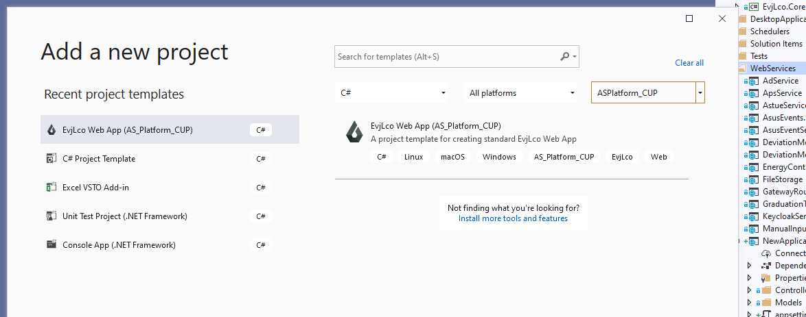
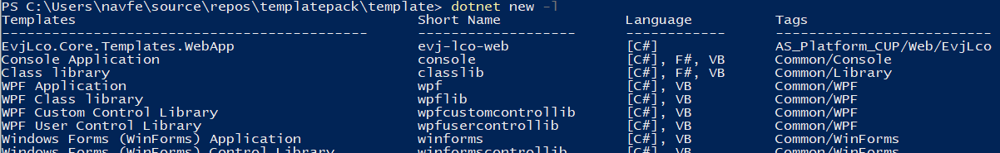
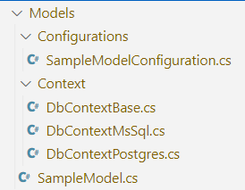

# Темы для митапа

## Создание шаблона проекта или класса для dotnet CLI

В ходе презентации будем создавать свой шаблон веб-приложения ASP.NET Core

Пример выбора своего шаблона при добавлении проекта в Visual Studio 2019:

Выбор шаблона в инструментах командной строки dotnet (CLI tool):

### План презентации

* Когда может понадобиться создавать свои шаблоны проектов, классов
* Как выглядело создание шаблонов в Visual Studio раньше (устаревший формат `vstemplate`)
* Что даёт новый формат шаблонов в dotnet core
* Создание простого шаблона веб-проекта в прямом эфире с нуля
* Добавление параметров командной строки, настройка шаблонизации в C# файлах, а также в файлах csproj, json
* Упаковка и публикация шаблонов в виде NuGet-пакета, установка шаблона средствами dotnet CLI

## C# для практикующих: парсинг JSON файлов и сохранения данных в БД на dotnet и EF Core

Рассмотрим типовую задачу создать приложение, которое:
* читает json-файл установленного формата с данными
* выполняет некоторую обработку данных
* сохраняет их в БД

В прямом эфире создадим приложение на dotnet core

Используемые технологии: Visual Studio 2019, dotnet CLI, EF Core

* Автоматическая генерация C# классов на основе примера json-файла
* Чтение json, парсинг в объекты нужных классов
* Потоковое чтение больших json-файлов
* Использование LINQ для фильтрации, сортировки и преобразования данных
* Добавление в проект Entity Framework Core, создание контекста БД с добавлением моделей
* Основы подхода code-first и концепции миграций базы данных
* Добавление и применений миграций с моделями
* Обновление БД на SQL Server, демонстрация работы приложения на примере реального файла
* Добавление нового поля, применение миграции с изменениями
* Экспорт миграций в SQL файл

[Код проекта](https://github.com/navferty/DeserializationSample)

Заметки для себя:
* Продемонстрировать ошибку при попытке создания миграции, когда отсутствует первичный ключ у сущностей.
Рассказать о необходимости первичного ключа (свойство с именем Id).
* При попытке запуска приложения после добавления новых полей FileName и LoadedAt - ошибка, нет нужных столбцов.
Продемонстрировать необходимость добавления миграции для актуализации схемы БД. Новые миграции нужно применить к БД.
* Продемонстрировать удаление миграции, например если забыли указать дефолтное значение для нового столбца LoadedAt.
Дефолтное значение можно прописать в методе DbContext.OnModelCreating

Ссылки:
* [Getting Started with EF Core](https://docs.microsoft.com/en-us/ef/core/get-started/overview/first-app?tabs=netcore-cli)
* [metanit - Первое приложение на EF Core](https://metanit.com/sharp/entityframeworkcore/1.2.php)
* [Примеры XML на w3schools](https://www.w3schools.com/xml/xml_examples.asp)

## Создание надстройки для MS Excel на VSTO

Использование Visual Studio Tools for Office для создание надстройки в приложении MS Office (на примере MS Excel).

*Если тема будет интересна, распишу подробнее*

[Пример надстройки](https://github.com/navferty/NavfertyExcelAddIn) общего назначения, проект который я ковыряю в свободное время:

## Усидеть на двух стульях: использование MS SQL и PostgreSQL в одном проекте

Мы на своем проекте используем подход code-first при проектировании БД. Это мейнстрим для приложений, использующих Entity Framework Core.
В силу того, что разные заказчики нашего проекта используют разные СУБД, нам приходится параллельно поддерживать схему БД и для MS SQL Server, и для PostgreSQL.

На занятии мы создадим проект, который будет содержать два DbContext'а и два набора конфигураций и миграций, и убедимся в работоспособности проекта с любой из указанных СУБД.

